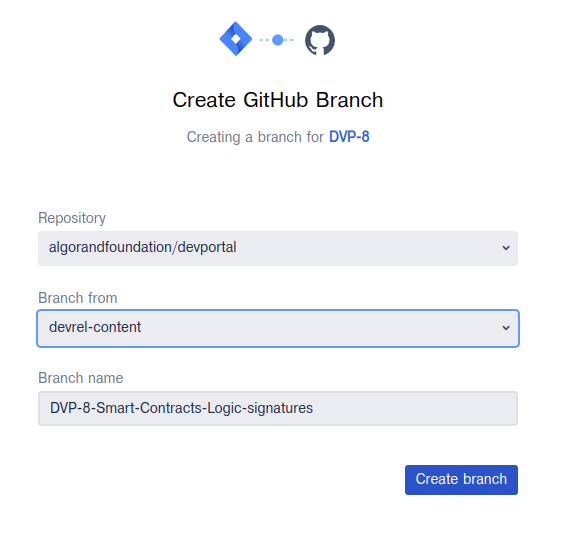

# Contributing

We are currently not using any Conventional Commits or any specific conventions.
Work is branched and merged from [devrel-content](https://github.com/algorandfoundation/devportal/tree/devrel-content) as the main trunk.

## Get Started

First start by navigating to a [ticket in JIRA](https://algorandfoundation.atlassian.net/jira/your-work)

### Create Branch

Initiate the GitHub Integration


Follow the steps outlined here:

1. Set Repository to the associated codebase
2. Ensure the branch is set to `devrel-contnet`
3. Take note of the Branch that is generated




### Setup Repository

Clone the repository if it has not been done already. 
This only has to be done once to set up the project

```bash
git clone git@github.com:algorandfoundation/devportal.git
```

Update the latest changes from the remote repository

```bash
git fetch
```

Checkout the newly created branch, this is the Branch that was created for the ticket above.

```bash
git checkout DVP-Smart-Contracts-Logic-signatures
```

### Submitting Changes

Provide a descriptive commit message that outlines the changes. 
Changes must be done via a Pull Request (PR). 
A pull request should be submitted from the branch created by JIRA to the `devrel-content` branch.

Ensure the following acceptance criteria are met before submitting a PR:

- Ensure there are no typos in the content
- Ensure `pnpm run lint` passes
- Ensure `pnpm run build` passes

### Publishing
> This may change in the future in favor of trunk-based development

After a change has been reviewed and merged into `devrel-content`, 
it is then merged into the [staging distribution channel](https://github.com/algorandfoundation/devportal/tree/staging).
Finally, it is merged into the [production distribution channel](https://github.com/algorandfoundation/devportal/tree/main)

